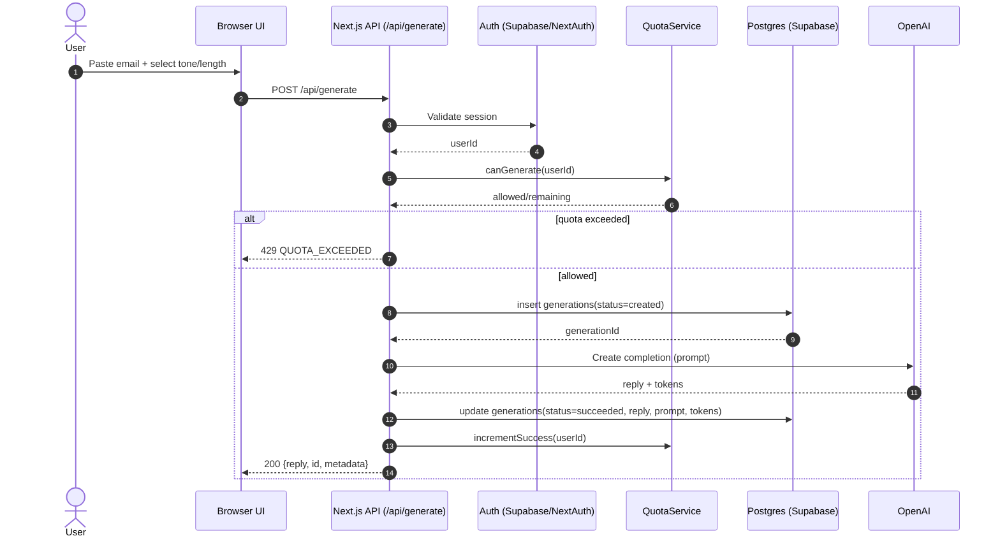
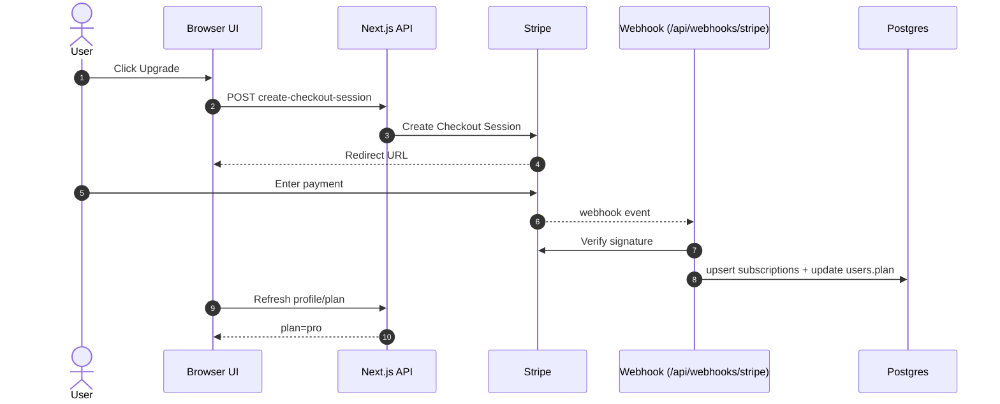
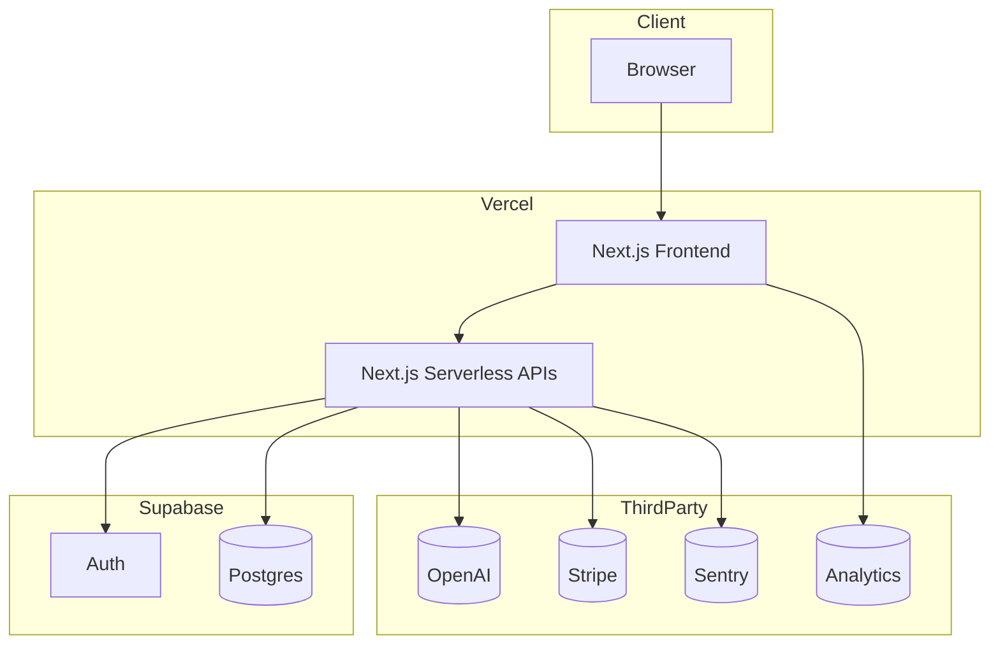
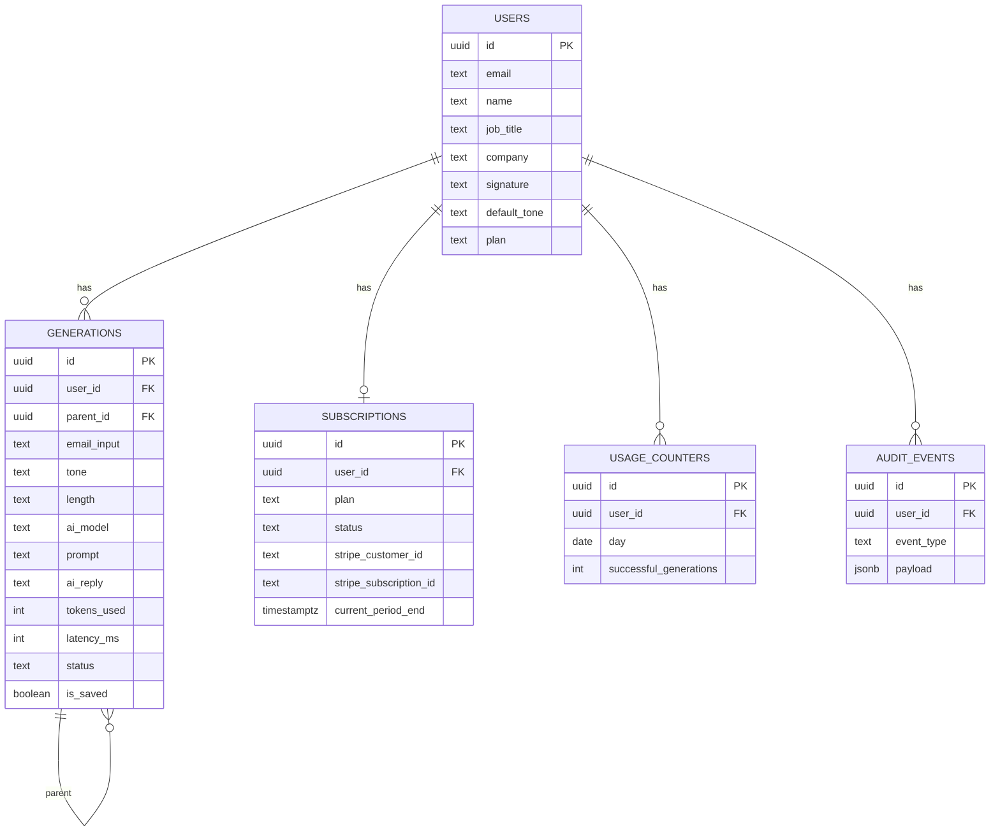

# Architecture Diagrams (Mermaid)

These diagrams are derived from `MASTER_SPEC.md` + `ARCHITECTURE.md`.

## 1) Component diagram

```mermaid
flowchart LR
  U[User Browser] -->|HTTPS| NX[Next.js App (Vercel)]

  subgraph Vercel[Hosting: Vercel]
    NX --> API[Route Handlers /api/*]
    NX --> UI[App Router Pages]
    API --> LLM[LLM Adapter]
    API --> DB[DB Access Layer]
    API --> BILL[Billing Adapter]
    API --> Q[Quota Service]
    API --> AN[Analytics Emitter]
  end

  subgraph Supabase[Supabase]
    SBAuth[Auth] 
    PG[(Postgres)]
  end

  subgraph External[External Services]
    OpenAI[(OpenAI API)]
    Stripe[(Stripe)]
    PostHog[(PostHog/Plausible)]
    Sentry[(Sentry)]
  end

  NX <--> SBAuth
  DB <--> PG
  LLM --> OpenAI
  BILL <--> Stripe
  AN --> PostHog
  API --> Sentry
```

## 2) Sequence diagram — generate reply



## 3) Sequence diagram — Stripe subscription



## 4) Deployment diagram



## 5) ER diagram (Mermaid)

> Source of truth is `ER_DIAGRAM.dbml`. This Mermaid view is for quick docs.


